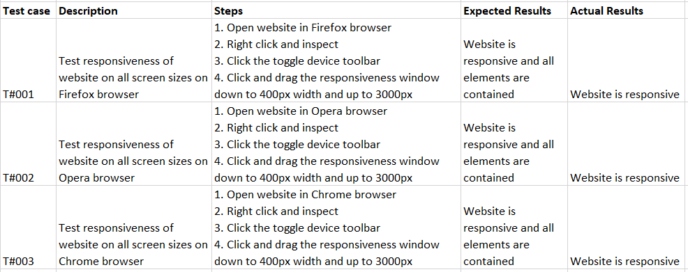

# Simple Calculator

The live website can be found [here](https://santos-uprety.github.io/Simple-Calculator)

## Purpose
This project was created for the purpose of Second Project Portfolio for The Code Institute's Full Stack Development course.

## Table of Contents
* [User Experience Design (UX)](#User-Experience-Design)
    * [The Strategy Plane](#The-Strategy-Plane)
    * [User stories](#User-Stories)
    * [The Scope Plane](#The-Scope-Plane)
    * [The Structure Plane](#The-Structure-Plane)
    * [The Surface Plane](#The-Surface-Plane)
    * [Design](#Design)
            * [Colour Scheme](#Colour-Scheme)
            * [Typography](#Typography)
    * [Differences to Design](#Differences-to-Design)
- [Features](#Features)
    * [Existing Features](#Existing-Features)
    * [Features Left to Implement](#Features-Left-to-Implement)
* [Technologies](#Technologies)
* [Testing](#Testing)

    * [Test Strategy](#Test-Strategy)
    * [Test Results](#Test-Results)
    * [Issues and Resolutions](#Issues-and-Resolutions-to-issues-found-during-testing)
*   [Deployment](#Deployment)

    * [Project Creation](#Project-Creation)
    * [GitHub Pages](#Using-Github-Pages)

* [Credits](#Credits)
  * [Acknowledgements](#Acknowledgements)

****

## User Experience Design
### **The Strategy Plane**
This project was created to test my knowledge of HTML, CSS and JavaScript and to offer users some experience with fully functional calculator.

Objectives of the project:
* To implement the basic skills I have learnt in HTML, CSS and JavaScript.
* To create interactive and fully responsive calculator.

#### User stories
* As a user, I want to grasp the site's main purpose quickly.
* As a user, I want to see clear contrast of colours upon initial opening.
* As a user, I want this website to be responsive and to be able to use it in different devices.
* As a user, I want to access a calculator that works properly and delivers accurate data.

### **The Scope Plane**
Features planned:
* Buttons - interactive and responsive
* Display screen - clear and visible

### **The Structure Plane**

User Story:
> As a user, I want to grasp the site's main purpose quickly.
 
 Acceptance Criteria:
* The calculator is designed to be user-friendly and efficient.
* The calculator is ready for use upon initial opening.

Description: 
As soon as I launch the page, I can start performing calculations without any additional steps. The interface is intuitive and responsive, and the results are displayed instantly.

User Story:
> As a user, I want to see clear contrast of colours upon initial opening.
 
 Acceptance Criteria:
 * The colours used are easily distinguishable and do not cause eye strain or confusion.
 

Description: 
One of the requirements for the user interface design is to ensure that the colours used in this design are carefully chosen, so that I can navigate without difficulty and enjoy the visual experience.

User Story:
> As a user, I want this website to be responsive and to be able to use it in different devices.
 
 Acceptance Criteria:
 * The calculator should adapt to different screen sizes and orientations.
 * The calculator should load quickly and smoothly on various devices and browsers.

Description: 
My web design approach relies on flex properties rather then media queries to achieve responsiveness. This means that the layout can adapt to different screen sizes and orientations without compromising the user experience.

User Story:
> As a user, I want to access a calculator that works properly and delivers accurate data.
 
 Acceptance Criteria:
 * The calculator should perform basic arithmetic operations such as addition, subtraction, multiplication and division.
 * The calculator should clear the previous result when a new operation is started.

Description: 
I expect the calculator to work properly, give accurate results and support various mathematical operations and functions. The calculator should be reliable, fast and error-free.

### **The Surface Plane**
### Design

#### Colour Scheme
Special character buttons: rgba(230, 155, 17, 0.87),
Numbers buttons: aliceblue,
Background: grey.

#### Typography
The font used here is from ['https://fonts.googleapis.com/css2?family=Oswald:wght@300;400;700&family=Poppins:wght@100;300;400;500;700&family=Roboto:wght@100;300;400;500;700&display=swap']

#### Differences to Design

All aspects specified in the Structure Plane were executed according to plan.

****
## Features

### Existing Features

Our calculator is easy and convenient to use and is designed to be user-friendly. It can perform basic arithmetic operations, such as addition, subtraction, multiplication and division.

### Features Left to Implement
* One of the features left to implement in our calculator is the ability to handle decimal points. Currently, our calculator only works with integers, which limits its functionality and accuracy. We need to modify our code to accept and process decimal inputs and outputs, as well as round them appropriately. Another feature we need to upgrade is our equation solver. Right now, it can only handle basic arithmetic operations, but we want to expand it to include more complex expressions, such as fractions, exponents, roots, trigonometry, and logarithms. This will require us to implement a parser and an evaluator for the equations, as well as a user interface that allows the user to enter and edit them easily.

****
## Technologies
* [JavaScript] (https://en.wikipedia.org/wiki/javascript)
	* This project relies on JavaScript for creating, manipulating and updating functions of the calculator.
* [HTML](https://en.wikipedia.org/wiki/HTML)
	* This project uses HTML as the main language used to complete the structure of the calculator.
* [CSS](https://en.wikipedia.org/wiki/CSS)
	* This project uses custom written CSS to style the calculator.
* [Google Fonts](https://fonts.google.com/)
	* Google fonts are used throughout the project to import the *Oswald* and *sans-serif* fonts.
* [GitHub](https://github.com/)
	* GithHub is the hosting site used to store the source code for the Website and [Git Pages](https://pages.github.com/) is used for the deployment of the live site.
* [Git](https://gitpod.io/)
	* Git is used as version control software to commit and push code to the GitHub repository where the source code is stored.   
* [Google Chrome Developer Tools](https://developers.google.com/web/tools/chrome-devtools)
	* Google chromes built in developer tools are used to inspect page elements and help debug issues with the site layout and test different CSS styles.
* [Techsini](http://techsini.com/multi-mockup/index.php)
    * Techsini.com Multi Device Website Mockup Generator was used to create the Mock up image in this README.

****
## Testing

### Test Strategy

#### **Summary**

Testing is done to validate HTML and CSS codes.

HTML code must pass through the [W3C HTML Validator](https://validator.w3.org/).

CSS code must pass through the [W3C CSS Validator](https://jigsaw.w3.org/css-validator/).

JavaScript code must pass through[JavaScript validator](https://jshint.com/)

Accessibility

Home desktop
 

Home mobile
 

### Test Results

 

### Issues and Resolutions

No issues

## Deployment

### Project Creation
The first step in this project was to set up a new repository using the Gitpod full template from Code Institute. I gave the repository a name and made it public. Then I clicked on the button to create a new repository from the template. Next, I opened the Gitpod editor and selected the repository I had just created. I added an index.html file and a folder called assets that contained a css folder. Inside the css folder, I created a style.css file. I also created JS folder inside which I created script.js file.

The following commands were used for version control throughout the project:
* git add filename - This command was used to add files to the staging area before committing.
* git commit -m "commit message explaining the updates" - This command was used to to commit changes to the local repository.
* git push - This command is used to push all committed changes to the GitHub repository.

### GitHub Pages
1. Navigate to the GitHub [Repository:](https://santos-uprety.github.io/Simple-Calculator/)
1. Click the 'Settings' Tab.
1. Scroll Down to the Git Hub Pages Heading.
1. Select 'Main Branch' as the source.
1. Click the Save button.
1. Click on the link to go to the live deployed page.

****
## Credits
Credit to https://www.w3schools.com/, https://developer.mozilla.org/ and Code Institute Love Maths Walkthrough project and also 100jsprojects.

### Acknowledgements
I would like to thank my tutor Ronan for his support and insights.
****